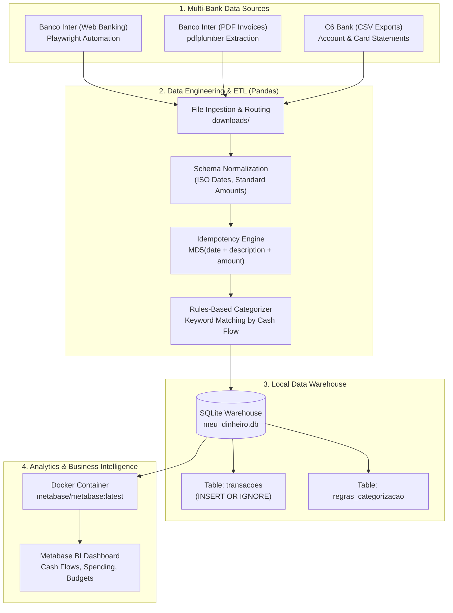

# 🏦 Automated Personal Finance Data Pipeline (ETL & BI)

[](https://www.python.org/)
[](https://playwright.dev/)
[](https://www.sqlite.org/)
[](https://www.docker.com/)
[](LICENSE)

> **A privacy-first, local ETL pipeline and Business Intelligence solution for personal finance.**  
> Automatically ingests, cleans, deduplicates, and categorizes financial transactions from multiple financial institutions (Banco Inter and C6 Bank) into a local SQLite warehouse visualized via self-hosted Metabase dashboards.

---

## 🏗️ Architecture Overview



---

## 🌟 Key Engineering Highlights

- **100% Local & Privacy-Preserving**: No third-party open-banking aggregators or cloud platforms have access to your financial data. All computations and storage happen entirely on your workstation.
- **Strict Idempotency**: Transactions generate a deterministic MD5 hash:
  $$\text{id\_hash} = \text{MD5}(\text{date} + \text{description} + \text{amount})$$
  Ensures zero duplicate transactions in the data warehouse, even when re-processing overlapping statements or running pipelines repeatedly (`INSERT OR IGNORE`).
- **Multi-Source & Multi-Format Ingestion**:
  - **Banco Inter**: Automated Playwright widget with QR code authentication for checking accounts, alongside robust `pdfplumber` parsing for multi-page PDF credit card bills.
  - **C6 Bank**: Automated ingestion of manually dropped CSV statements and credit card sheets, identified by content sniffing.
- **Fault-Tolerant & Resilient Pipeline**: Each input file is processed in an isolated `try/except` block. Failure in one bank or format never crashes data extraction from the others. Original source files are deleted **only after confirmed database commit**.
- **Interactive Rules & Category Engine**: Includes a terminal CLI for training keyword-to-category rules, handling installment transaction splitting (`manage_portions.py`), and immediate category overrides (`correct_category.py`).
- **Healthcheck-Driven BI Orchestration**: Windows `.bat` and Linux `.sh` execution scripts automatically manage container lifecycles and poll HTTP health endpoints (`/api/health`) before launching dashboards.

---

## 📁 Repository Structure

```text
├── inter_crawler.py        # Playwright automation for Banco Inter web banking
├── etl_processor.py        # Core ETL: CSV/PDF parsers, MD5 hashing, database upsert
├── main.py                 # CLI pipeline orchestrator
├── train_rules.py          # Interactive CLI for orphan transaction categorization
├── correct_category.py     # Utility for manual category overrides by transaction hash
├── manage_portions.py      # Utility for splitting one-off purchases into future installments
├── requirements.txt        # Python project dependencies
├── .env.example             # Template for external folder paths
├── execution_examples/      # Windows (.bat) and Linux/macOS (.sh) launch scripts
│   ├── start_pipeline.sh
│   ├── start_pipeline.bat
│   ├── correct_category.sh
│   ├── correct_category.bat
│   ├── manage_installments.sh
│   └── manage_installments.bat
└── README.md                # Project documentation
```

---

## 🚀 Getting Started

### Prerequisites

- **Python 3.10+**
- **Docker Desktop** (or native Docker daemon on Linux)
- **Windows Subsystem for Linux (WSL)** or native Linux/macOS

### 1. Installation

Clone this repository and create a virtual environment:

```bash
git clone https://github.com/your-username/personal-finance-data-pipeline.git
cd personal-finance-data-pipeline

python3 -m venv venv
source venv/bin/activate  # On Windows without WSL: venv\Scripts\activate
```

Install dependencies and browser binaries for Playwright:

```bash
pip install -r requirements.txt
playwright install chromium
```

### 2. Configuration

Copy the sample environment file:

```bash
cp .env.example .env
```

Configure the paths to your local statement folders in `.env`:

```env
C6_STATEMENTS_PATH="/path/to/your/C6_Statements"
INTER_INVOICES_PATH="/path/to/your/Inter_Invoices"
```

### 3. Running the Pipeline

Run the main orchestrator script:

```bash
python main.py
```

The CLI will prompt you to:
1. Select statement period (7, 15, 30, or 90 days).
2. Scan the Banco Inter login QR code in the browser window.
3. Automatically process, deduplicate, and load all transactions into SQLite.
4. Optionally classify any new uncategorized transactions.

Alternatively, use the ready-to-run automation scripts in `execution_examples/`.

---

## 🛠️ CLI Utilities

### Manual Installment Splitting (`manage_portions.py`)
Splits large one-off purchases into monthly installments:
1. Retrieve the transaction `id_hash` from Metabase or SQLite.
2. Run `python manage_portions.py` (or execute `manage_installments.bat`).
3. Enter the `id_hash` and the number of installments (e.g. 10). The script will adjust installment 1 and generate future dated records with unique hashes.

### Category Override (`correct_category.py`)
Fixes misclassified entries without direct database queries:
1. Retrieve the transaction `id_hash`.
2. Run `python correct_category.py` (or execute `correct_category.bat`).
3. Enter the `id_hash` and the corrected category name.

---

## 📊 Business Intelligence (Metabase)

Start the Metabase container with persistent database mapping:

```bash
docker run -d -p 3000:3000 \
  -v "$(pwd)":/dados_projeto \
  --name metabase_financas \
  metabase/metabase:latest
```

1. Open your browser at `http://localhost:3000`.
2. Complete the initial local admin setup.
3. Add a new database: select **SQLite**.
4. In the **Database file path** field, input: `/dados_projeto/meu_dinheiro.db`.
5. Build dashboards for monthly burn rate, categorized spending, cash inflows, and trend analyses.

---

## 📄 License

This project is licensed under the [MIT License](LICENSE).